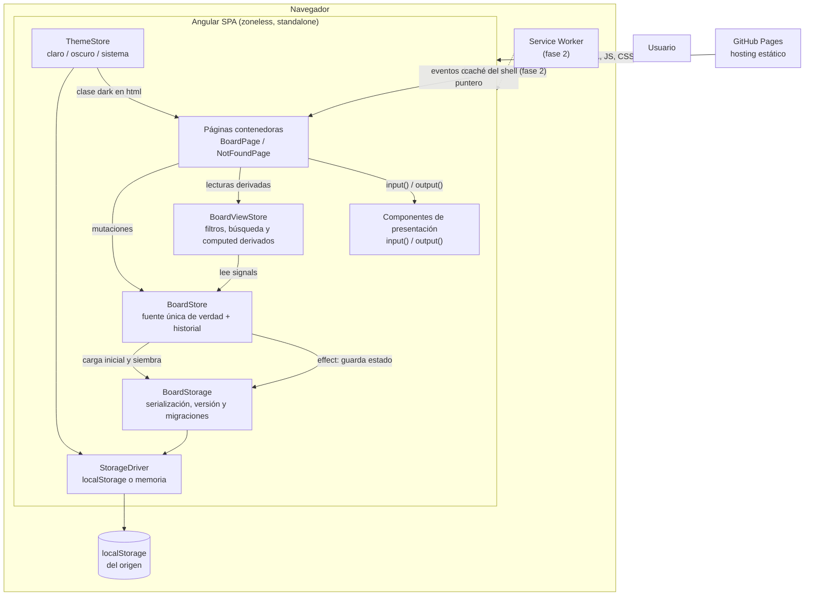
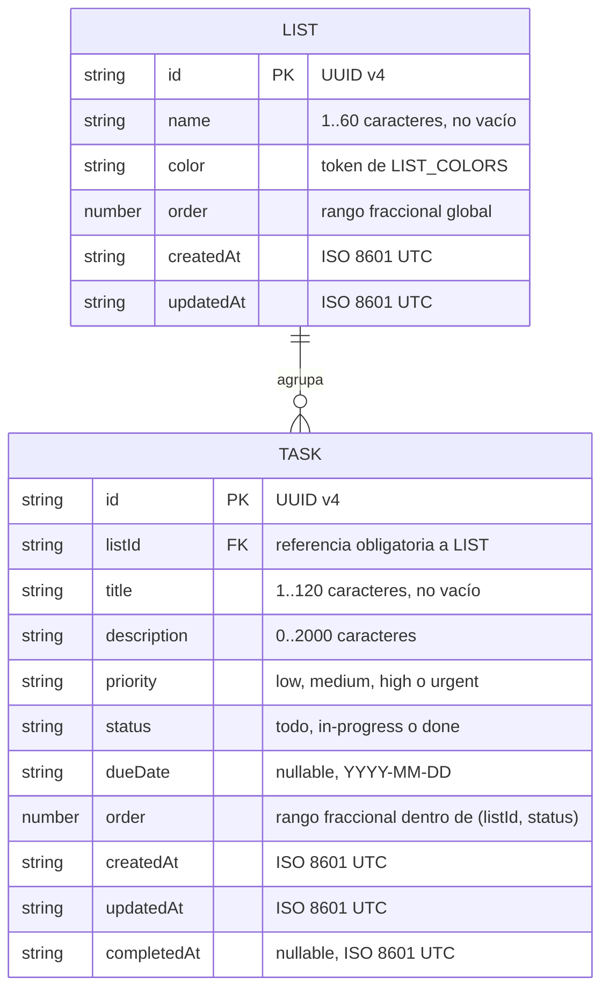
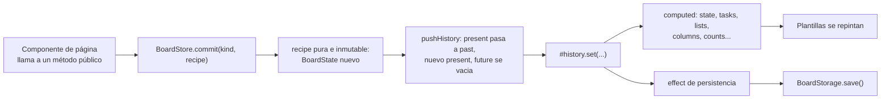

# Arquitectura — tareas-angular

Gestor de tareas estilo kanban con una experiencia de teclado cuidada. La
aplicación es **100 % cliente**: no hay servidor propio, ni base de datos, ni
llamadas de red. Todos los datos viven en el navegador del usuario.

Este documento fija el plano de la implementación: modelo de datos, arquitectura
de estado, persistencia, contratos de servicios y la preparación explícita para
la segunda fase (kanban con arrastre entre columnas, paleta de comandos,
deshacer/rehacer global y PWA offline).

---

## 1. Visión general y decisiones clave

### 1.1 Por qué frontend-only

La aplicación es de uso personal y monodispositivo: no hay colaboración, ni
cuentas, ni datos compartidos entre usuarios. Un backend añadiría autenticación,
despliegue de servidor, base de datos y coste operativo sin aportar nada al
producto. Sin servidor:

- El despliegue es un artefacto estático en GitHub Pages, gratuito y sin
  mantenimiento.
- La latencia percibida es cero: toda mutación es síncrona en memoria.
- El modo offline de la fase 2 es casi gratis, porque no hay nada que
  sincronizar.

El precio a pagar está asumido y documentado: los datos son locales al navegador
y al perfil; borrar los datos del sitio los elimina, y no hay copia de seguridad
automática. La UI lo comunica y ofrece vaciar el tablero de forma explícita.

### 1.2 Por qué signals como modelo de estado

Todo el estado del dominio es **local y síncrono**: no hay peticiones, ni
carreras, ni cancelaciones. Ese es exactamente el terreno de los signals y no el
de RxJS. Con signals se obtiene:

- Un grafo de dependencias explícito: los datos derivados (columnas, filtros,
  contadores, vencidas) son `computed` y se recalculan solos, sin sincronización
  manual ni riesgo de estado duplicado.
- Cero suscripciones que gestionar y cero fugas por olvidar `unsubscribe`.
- Detección de cambios de grano fino, que es lo que permite que una vista kanban
  con decenas de tarjetas se sienta instantánea al arrastrar.

RxJS se queda como dependencia transitiva de Angular, pero **no se usa para el
estado de la aplicación**. Se admite puntualmente para eventos de DOM que se
benefician de operadores (por ejemplo, `debounce` del buscador), convertidos a
signal en el borde con `toSignal`.

### 1.3 Por qué zoneless

El proyecto se ejecuta sin `zone.js` (modo por defecto de Angular 22: no hay
polyfill de zonas en el bundle). Consecuencias:

- Menos JavaScript en el arranque y detección de cambios dirigida por el grafo
  de signals en lugar de por parcheo de APIs del navegador.
- Obliga a una disciplina sana: **si un dato se muestra en pantalla, vive en un
  signal**. No hay “monkey patching” que rescate una mutación de un campo suelto.
- Menos trabajo por frame durante el arrastre, donde se disparan muchos eventos
  seguidos.

Regla operativa derivada: ningún componente muta propiedades planas que la
plantilla lea. Todo lo que se pinta es `signal`, `computed`, `input()` o
`model()`.

### 1.4 Principios que ordenan el resto del documento

1. **Una sola fuente de verdad**: `BoardStore` posee el estado del tablero.
   Nadie más guarda copias.
2. **Componentes tontos**: solo los componentes de página inyectan servicios;
   el resto recibe `input()` y emite `output()`.
3. **Un único punto de mutación**: toda escritura del tablero pasa por
   `BoardStore.commit()`. Es lo que hace que deshacer/rehacer sea correcto por
   construcción.
4. **Estado inmutable**: cada mutación produce un `BoardState` nuevo reutilizando
   los objetos que no cambian. Esto abarata los snapshots del historial y hace
   triviales las comparaciones por referencia.
5. **Simplicidad deliberada**: es una aplicación de tablero personal. Nada de
   capas de abstracción especulativas, ni gestores de estado externos, ni
   normalización de entidades que la escala del problema no justifica.

---

## 2. Stack y versiones exactas

Versiones efectivamente instaladas y fijadas por el lockfile (`pnpm-lock.yaml`).

### Entorno

| Herramienta | Versión |
|---|---|
| Node.js | 24.18.0 |
| pnpm | 11.1.2 |

### Dependencias de ejecución

| Paquete | Versión |
|---|---|
| `@angular/core` | 22.0.8 |
| `@angular/common` | 22.0.8 |
| `@angular/compiler` | 22.0.8 |
| `@angular/forms` | 22.0.8 |
| `@angular/router` | 22.0.8 |
| `@angular/platform-browser` | 22.0.8 |
| `@angular/cdk` | 22.0.6 |
| `rxjs` | 7.8.2 |
| `tslib` | 2.8.1 |

### Dependencias de desarrollo

| Paquete | Versión |
|---|---|
| `@angular/cli` | 22.0.8 |
| `@angular/build` | 22.0.8 |
| `@angular/compiler-cli` | 22.0.8 |
| `typescript` | 6.0.3 |
| `tailwindcss` | 4.3.3 |
| `@tailwindcss/postcss` | 4.3.3 |
| `postcss` | 8.5.23 |
| `vitest` | 4.1.10 |
| `jsdom` | 28.1.0 |
| `prettier` | 3.9.6 |

### Configuración fijada

- **Sin NgModules**: todo standalone. `bootstrapApplication(App, appConfig)`.
- **Zoneless**: sin `zone.js` en dependencias ni en polyfills.
- **TypeScript estricto**: TypeScript 6 activa `strict` por defecto; el
  `tsconfig.json` añade `noImplicitOverride`, `noPropertyAccessFromIndexSignature`,
  `noImplicitReturns` y `noFallthroughCasesInSwitch`. No se relaja ninguna.
- **Tailwind CSS 4** por PostCSS (`.postcssrc.json` con `@tailwindcss/postcss`) y
  `@import 'tailwindcss'` en `src/styles.css`. Sin `tailwind.config.js`: el tema
  se define con `@theme` en CSS.
- **Modo oscuro por clase**: Tailwind 4 usa `prefers-color-scheme` por defecto;
  como hay conmutador manual, `src/styles.css` declara
  `@custom-variant dark (&:where(.dark, .dark *));` y el tema se aplica poniendo
  o quitando la clase `dark` en `<html>`.
- **Tests**: `@angular/build:unit-test` con Vitest y entorno `jsdom`.

---

## 3. Estrategia de renderizado y distribución

**SPA de renderizado en cliente (CSR), sin SSR ni SSG, servida como sitio
estático. En el MVP no es PWA; en la fase 2 sí, instalable y offline.**

Justificación:

- **SPA/CSR**: los datos están en `localStorage`, es decir, solo existen en el
  cliente. Un renderizado en servidor produciría un HTML vacío que habría que
  rehidratar de inmediato con los datos locales: complejidad sin beneficio.
  Además, una herramienta de productividad con arrastre, atajos y paleta de
  comandos es una aplicación de sesión larga, no un documento; el modelo SPA es
  el correcto.
- **Sin SSG/prerender**: solo hay una pantalla real (el tablero) y su contenido
  depende por completo del estado local. Prerenderizar no ahorra nada visible.
- **Sin SEO relevante**: es una herramienta, no contenido indexable. Se descarta
  cualquier argumento de posicionamiento a favor de SSR.
- **PWA en fase 2**: el MVP no registra service worker para no arrastrar
  problemas de caché durante el desarrollo inicial. Cuando el shell se estabilice
  se añade `@angular/service-worker`; el trabajo es solo cachear el shell,
  porque los datos ya son locales (ver §11.4).

### Distribución

- Artefacto: `pnpm build` produce estáticos en `dist/tareas-angular/browser/`.
- Hosting: GitHub Pages como *project page*, servida bajo el subdirectorio
  `/tareas-angular/`. El build de producción se ejecuta con
  `--base-href /tareas-angular/`.
- **Rutas profundas**: GitHub Pages no reescribe rutas al `index.html`. Se usa
  enrutado por ruta (URLs limpias, sin `#`) y el despliegue copia
  `index.html` a `404.html`; Pages sirve ese archivo ante cualquier ruta
  desconocida y el router de Angular resuelve desde ahí. Se descarta
  `withHashLocation()` por estética de URL.
- **Sin Docker**: no hay proceso servidor que empaquetar.
- La definición del flujo de integración y despliegue es responsabilidad de la
  configuración de CI del repositorio y no de este documento; aquí solo se fijan
  los requisitos (`--base-href`, copia de `404.html`, `pnpm install --frozen-lockfile`).

---

## 4. Diagrama del sistema



Puntos a destacar del diagrama:

- **No hay ninguna flecha hacia servicios externos.** Ninguna petición de red en
  tiempo de ejecución más allá de la descarga inicial de los estáticos.
- Las lecturas y las escrituras entran por caminos distintos: los componentes
  leen de `BoardViewStore` y escriben en `BoardStore`.
- `BoardStorage` es el único que conoce el formato serializado; `BoardStore`
  solo conoce el modelo de dominio.

---

## 5. Estructura de carpetas

Convención de nombres de Angular 22: los archivos **no** llevan sufijo de tipo
(`task-card.ts`, no `task-card.component.ts`; `board-store.ts`, no
`board-store.service.ts`). La excepción son los tipos que el CLI sigue
sufijando con guion: pipes (`-pipe.ts`) y guards (`-guard.ts`). Todos los
archivos en `kebab-case`, todas las clases en `PascalCase`.

```text
tareas-angular/
├── ARCHITECTURE.md
├── DESIGN.md                       # sistema visual y de interacción
├── README.md
├── angular.json
├── package.json
├── pnpm-lock.yaml
├── .postcssrc.json                 # Tailwind 4 vía PostCSS
├── tsconfig.json / tsconfig.app.json / tsconfig.spec.json
├── public/                         # activos servidos tal cual (favicon, iconos PWA en fase 2)
└── src/
    ├── index.html
    ├── main.ts                     # bootstrapApplication(App, appConfig)
    ├── styles.css                  # @import 'tailwindcss', @theme, variante dark
    └── app/
        ├── app.ts                  # shell: cabecera, navegación, <router-outlet>
        ├── app.html
        ├── app.css
        ├── app.config.ts           # providers raíz (router, listeners de error)
        ├── app.routes.ts
        ├── app.spec.ts
        │
        ├── core/                   # dominio, estado y servicios; sin plantillas
        │   ├── models/
        │   │   ├── task.ts         # Task, TaskStatus, TaskPriority, constantes
        │   │   ├── list.ts         # List, ListColor
        │   │   ├── board-state.ts  # BoardState y tipos de entrada (inputs)
        │   │   ├── mutation.ts     # MutationKind y sus etiquetas de UI
        │   │   └── index.ts        # reexportación única del modelo
        │   ├── state/
        │   │   ├── board-store.ts       # fuente única de verdad + historial
        │   │   ├── board-store.spec.ts
        │   │   ├── board-view-store.ts  # filtros, búsqueda y derivados
        │   │   ├── board-view-store.spec.ts
        │   │   ├── history.ts           # historial de snapshots (funciones puras)
        │   │   ├── history.spec.ts
        │   │   ├── theme-store.ts
        │   │   └── theme-store.spec.ts
        │   ├── storage/
        │   │   ├── storage-driver.ts    # interfaz + token de inyección
        │   │   ├── local-storage-driver.ts
        │   │   ├── memory-storage-driver.ts   # respaldo y doble de test
        │   │   ├── board-storage.ts     # carga, guardado, respaldo de datos corruptos
        │   │   ├── board-storage.spec.ts
        │   │   ├── schema.ts            # PersistedBoard, versión actual
        │   │   ├── migrations.ts        # cadena de migraciones por versión
        │   │   ├── migrations.spec.ts
        │   │   ├── seed.ts              # tablero de muestra de la primera visita
        │   │   └── seed.spec.ts
        │   └── util/
        │       ├── id.ts            # newId()
        │       ├── order.ts         # rangos fraccionales del arrastre
        │       ├── order.spec.ts
        │       ├── date.ts          # fechas ISO locales, vencimientos
        │       └── date.spec.ts
        │
        ├── features/
        │   ├── board/
        │   │   ├── board-page.ts    # contenedor: única capa que inyecta tiendas
        │   │   ├── board-page.html
        │   │   ├── board-page.css
        │   │   ├── board-page.spec.ts
        │   │   └── components/      # todos tontos: input() + output()
        │   │       ├── list-sidebar.ts / .html
        │   │       ├── board-toolbar.ts / .html      # búsqueda y filtros
        │   │       ├── task-column.ts / .html        # contenedor de arrastre del CDK
        │   │       ├── task-card.ts / .html
        │   │       ├── task-form.ts / .html          # alta y edición (Reactive Forms)
        │   │       └── empty-state.ts / .html
        │   └── not-found/
        │       ├── not-found-page.ts
        │       └── not-found-page.html
        │
        └── shared/
            ├── ui/                  # presentación pura y reutilizable
            │   ├── dialog.ts / .html
            │   ├── icon-button.ts / .html
            │   ├── badge.ts / .html
            │   └── confirm-dialog.ts / .html
            └── pipes/
                ├── due-label-pipe.ts        # "Vence mañana", "Venció hace 2 días"
                └── priority-label-pipe.ts   # etiqueta en español de la prioridad
```

Reglas de dependencia entre carpetas, verificables a simple vista en una
revisión:

- `core/` no importa nada de `features/` ni de `shared/`.
- `shared/` no importa nada de `features/` ni de `core/state/`.
- `features/` puede importar de `core/` y de `shared/`.
- Los archivos `*.spec.ts` viven junto al archivo que prueban.

---

## 6. Modelo de datos

No hay base de datos: el modelo es un conjunto de interfaces TypeScript que se
serializan a JSON en `localStorage`. Aun así se aplica la convención del equipo
de mantener marcas de tiempo de creación y actualización en toda entidad.

### 6.1 Tipos base

```ts
export type TaskId = string;
export type ListId = string;

/** Fecha de calendario local, formato 'YYYY-MM-DD'. Sin hora ni zona. */
export type IsoDate = string;

/** Instante en UTC, formato ISO 8601 completo. */
export type IsoDateTime = string;
```

Los identificadores son alias planos, no tipos marcados (*branded types*): en un
modelo de dos entidades el ruido sintáctico supera al beneficio.

Las fechas se guardan en dos formatos distintos a propósito. `dueDate` es una
fecha de calendario sin hora: quien escribe «vence el 3 de marzo» quiere el 3 de
marzo en su huso, no un instante que puede cambiar de día al cruzar husos.
Comparar cadenas `'YYYY-MM-DD'` entre sí es correcto lexicográficamente y elimina
de raíz los errores de desplazamiento de zona horaria. Las marcas de auditoría
(`createdAt`, `updatedAt`, `completedAt`) sí son instantes y se guardan en UTC.

### 6.2 Prioridad y estado

```ts
export const TASK_PRIORITIES = ['low', 'medium', 'high', 'urgent'] as const;
export type TaskPriority = (typeof TASK_PRIORITIES)[number];

export const TASK_STATUSES = ['todo', 'in-progress', 'done'] as const;
export type TaskStatus = (typeof TASK_STATUSES)[number];

/** Peso para ordenar por prioridad descendente. */
export const PRIORITY_WEIGHT: Record<TaskPriority, number> = {
  urgent: 3,
  high: 2,
  medium: 1,
  low: 0,
};
```

Se usan uniones de literales derivadas de una tupla `as const` en lugar de `enum`
de TypeScript: serializan a JSON tal cual, son exhaustivas en un `switch` y la
tupla sirve además para iterar en la UI en orden de presentación.

Las etiquetas visibles en español viven aparte, para que el modelo no mezcle
idiomas de capa:

```ts
export const PRIORITY_LABELS: Record<TaskPriority, string> = {
  low: 'Baja',
  medium: 'Media',
  high: 'Alta',
  urgent: 'Urgente',
};

export const STATUS_LABELS: Record<TaskStatus, string> = {
  'todo': 'Por hacer',
  'in-progress': 'En progreso',
  'done': 'Completada',
};
```

`TaskStatus` es al mismo tiempo el estado de la tarea y **la columna del kanban**.
No se introduce un concepto separado de «columna»: las columnas de la fase 2 son
exactamente los tres estados, en el orden de `TASK_STATUSES`. Columnas
configurables por el usuario quedan fuera de alcance.

### 6.3 Entidades

```ts
export interface Task {
  readonly id: TaskId;
  readonly listId: ListId;
  readonly title: string;
  /** Cadena vacía cuando no hay descripción; nunca null. */
  readonly description: string;
  readonly priority: TaskPriority;
  readonly status: TaskStatus;
  readonly dueDate: IsoDate | null;
  /** Rango fraccional dentro de (listId, status). Ver §6.5. */
  readonly order: number;
  readonly createdAt: IsoDateTime;
  readonly updatedAt: IsoDateTime;
  readonly completedAt: IsoDateTime | null;
}

export interface List {
  readonly id: ListId;
  readonly name: string;
  readonly color: ListColor;
  /** Rango fraccional dentro del conjunto de listas. */
  readonly order: number;
  readonly createdAt: IsoDateTime;
  readonly updatedAt: IsoDateTime;
}

export const LIST_COLORS = ['slate', 'blue', 'emerald', 'amber', 'rose', 'violet'] as const;
export type ListColor = (typeof LIST_COLORS)[number];
```

```ts
/** Estado completo del tablero: lo que se persiste y lo que fotografía el historial. */
export interface BoardState {
  readonly lists: readonly List[];
  readonly tasks: readonly Task[];
}
```

Se guardan **arreglos planos**, no mapas normalizados por id. Con decenas o
cientos de tareas, filtrar un arreglo es irrelevante en coste y a cambio se gana
una serialización JSON directa y un modelo trivial de leer. Cuando hace falta
acceso por clave, la tienda expone un índice `computed`
(`Map<TaskId, Task>`), que se recalcula solo cuando cambian las tareas.

### 6.4 Diagrama entidad-relación

Es el modelo lógico persistido en `localStorage`, no un esquema relacional.



### 6.5 Ordenamiento: rangos fraccionales

Es la decisión que sostiene el arrastre. El requisito es reordenar dentro de una
columna **y** mover entre columnas sin reindexar el resto de tarjetas.

**Regla: `order` es un número de coma flotante y su ámbito de unicidad es la
tupla `(listId, status)`.** No es un índice de posición: es un rango relativo.
Dos tareas en columnas distintas pueden compartir `order` sin conflicto, porque
nunca se comparan entre sí.

```ts
/** Separación por defecto entre elementos consecutivos. */
export const ORDER_STEP = 1024;

/** Por debajo de esta distancia se reequilibra la columna. */
export const MIN_ORDER_DELTA = 1e-6;

/** Rango situado entre dos vecinos; null indica borde de la columna. */
export function rankBetween(before: number | null, after: number | null): number;

/** true cuando los vecinos están tan juntos que conviene reequilibrar. */
export function needsRebalance(before: number | null, after: number | null): boolean;

/** Reasigna 0, ORDER_STEP, 2*ORDER_STEP... a una única columna ya ordenada. */
export function rebalance<T extends { order: number }>(column: readonly T[]): T[];

/** Comparador total y estable: order, luego createdAt, luego id. */
export function byOrder<T extends { order: number; createdAt: string; id: string }>(a: T, b: T): number;
```

Semántica de `rankBetween`:

| `before` | `after` | Resultado |
|---|---|---|
| `null` | `null` | `0` (columna vacía) |
| `null` | `x` | `x - ORDER_STEP` (insertar al inicio) |
| `x` | `null` | `x + ORDER_STEP` (insertar al final) |
| `x` | `y` | `(x + y) / 2` (insertar en medio) |

Coste de cada operación:

- **Reordenar dentro de una columna**: cambia **una sola tarea** (su `order`).
- **Mover entre columnas**: cambia **una sola tarea** (`status` y/o `listId` más
  su `order`). Ni la columna de origen ni el resto de la de destino se tocan.
- **Crear**: una sola tarea, al inicio o al final según el punto de creación.

El único caso degenerado es insertar muchas veces entre las dos mismas tarjetas:
la distancia se divide entre dos cada vez. Con `ORDER_STEP = 1024` y coma
flotante de doble precisión hacen falta más de mil inserciones consecutivas en el
mismo hueco para agotar la precisión, algo que no ocurre en uso real; aun así
`needsRebalance` lo detecta y `rebalance` renumera **esa columna y solo esa**.
El reequilibrio es una operación técnica: no modifica `updatedAt` ni entra en el
historial como una acción del usuario aparte, viaja dentro de la misma mutación.

Se descartó el orden lexicográfico por cadenas (estilo LexoRank) porque resuelve
un problema que aquí no existe —concurrencia entre clientes— a cambio de una
aritmética de cadenas mucho más difícil de leer y depurar. Se descartó también el
índice entero contiguo: obliga a reescribir todas las tareas posteriores en cada
arrastre, lo que multiplicaría el tamaño de cada snapshot del historial y
provocaría escrituras completas en cada movimiento.

**Contrato con el CDK**: `moveTask` recibe un `targetIndex` que se interpreta
como la posición final de la tarea dentro de la columna de destino, es decir,
exactamente el `currentIndex` que entrega `CdkDragDrop`. La tienda reconstruye la
columna de destino excluyendo la tarea movida, toma los vecinos en
`targetIndex - 1` y `targetIndex`, y calcula el rango. La misma ruta de código
sirve para movimientos dentro de la columna y entre columnas.

### 6.6 Invariantes

Las obligaciones que la tienda garantiza y que los tests verifican:

1. Todo `task.listId` referencia una `List` existente. No hay tareas huérfanas.
2. Borrar una lista borra en cascada sus tareas, **en una sola entrada del
   historial**: deshacer restituye lista y tareas juntas.
3. Siempre existe al menos una lista. Se impide borrar la última.
4. `order` es único dentro de `(listId, status)`; entre columnas distintas no
   tiene ningún significado comparativo.
5. `title` no está vacío tras `trim()` y no supera 120 caracteres.
   `description` no supera 2000. `name` de lista: 1..60.
6. `status === 'done'` si y solo si `completedAt !== null`.
7. `updatedAt >= createdAt`, y toda mutación que cambie campos de negocio
   actualiza `updatedAt`.
8. Los identificadores se generan con `crypto.randomUUID()` y no se reutilizan.
9. Una tarea está vencida cuando `dueDate !== null && dueDate < hoy && status !== 'done'`.
   Vencer es un estado **derivado**, nunca se persiste.

### 6.7 Borrado físico, no lógico

La convención del equipo pide borrado lógico en bases de datos relacionales.
Aquí se hace **borrado físico** de forma consciente, por tres razones:

- No es una base de datos relacional ni hay informes históricos que dependan de
  filas borradas.
- El historial de deshacer/rehacer ya cubre el caso real que motiva el borrado
  lógico —recuperar algo eliminado por error— y lo hace mejor, porque restaura
  la tarea completa con su posición.
- Las filas marcadas como inactivas crecerían indefinidamente contra una cuota de
  unos 5 MB y engordarían cada snapshot del historial y cada escritura.

Las marcas de tiempo de creación y actualización sí se mantienen, tal como pide
la convención.

---

## 7. Arquitectura de estado con signals

### 7.1 Reparto de responsabilidades

| Servicio | Ámbito | Responsabilidad |
|---|---|---|
| `BoardStore` | `root` | **Fuente única de verdad** del tablero. Estado, mutaciones e historial. |
| `BoardViewStore` | `root` | Capa de consulta: búsqueda, filtros y todos los derivados de presentación. |
| `ThemeStore` | `root` | Preferencia de tema y su aplicación al DOM. |
| `BoardStorage` | `root` | Traducción entre `BoardState` y el texto guardado; versión y migraciones. |
| `StorageDriver` | token | Acceso crudo a `localStorage`, con respaldo en memoria. |

No hay más servicios. En particular, no hay «servicio de tareas» separado del
«servicio de listas»: son la misma agregación y separarlas obligaría a
coordinar dos historiales.

### 7.2 Signal frente a computed

La regla es tajante: **solo es `signal` aquello que el usuario cambia
directamente; todo lo demás es `computed`.**

Estado escribible (fuentes):

| Signal | Dueño | Persistido |
|---|---|---|
| `#history: History<BoardState>` | `BoardStore` | solo su `present` |
| `#seeded: boolean` | `BoardStore` | sí, como metadato |
| `#persistenceError: PersistenceError \| null` | `BoardStore` | no |
| `#query: string` | `BoardViewStore` | no |
| `#statusFilter: StatusFilter` | `BoardViewStore` | no |
| `#priorityFilter: TaskPriority \| null` | `BoardViewStore` | no |
| `#activeListId: ListId \| null` | `BoardViewStore` | no (vive en la ruta) |
| `#preference: ThemePreference` | `ThemeStore` | sí, en su propia clave |

Todo lo demás es derivado: `state`, `tasks`, `lists`, `taskIndex`, `canUndo`,
`canRedo`, `visibleTasks`, `columns`, `counts`, `overdueCount`, `resolvedTheme`.
Ningún `computed` escribe; ningún `effect` calcula datos de dominio.

Nótese que **el historial completo cabe en un único signal**. El estado actual
del tablero es `computed(() => this.#history().present.value)`. Esto elimina la
posibilidad de que el estado y su historial se desincronicen: son el mismo dato.

### 7.3 Flujo de una mutación



El corazón del diseño es este método privado:

```ts
private commit(kind: MutationKind, recipe: (current: BoardState) => BoardState): void;
```

**Todas** las mutaciones del MVP —crear, editar, completar, borrar, mover,
reordenar, vaciar el tablero— pasan por él, aunque en el MVP el historial no se
exponga todavía en la UI. `undo()` y `redo()` no pasan por `commit`: manipulan
las pilas del historial y por tanto no generan entradas nuevas.

`recipe` es una función pura: recibe el estado actual y devuelve uno nuevo. No
tiene acceso a servicios, no lee la hora del sistema ni genera identificadores;
esos valores se calculan antes de invocarla y se capturan en el cierre. Así cada
receta es determinista y comprobable de forma aislada.

Estado explícitamente **fuera** del historial: tema, filtros, texto de búsqueda,
lista activa, diálogos abiertos y errores de persistencia. Deshacer debe deshacer
acciones sobre datos, no restaurar un filtro que el usuario cambió por el camino.

### 7.4 Mecanismo de deshacer/rehacer: snapshots del estado

Se elige **historial de snapshots inmutables (patrón *memento*)** y se descarta
el patrón de comandos invertibles. Justificación:

1. **Corrección por construcción.** Con comandos invertibles, cada acción exige
   escribir y mantener su inversa exacta. Las inversas asimétricas son una fuente
   clásica de errores sutiles: deshacer un movimiento entre columnas debe
   restaurar `status`, `listId`, `order` y `updatedAt` en su valor previo exacto;
   deshacer el borrado de una lista debe resucitar la lista y todas sus tareas en
   su orden original. Con snapshots no hay inversa que escribir: restaurar es
   asignar el estado anterior.
2. **Coste real bajo gracias a la inmutabilidad estructural.** Cada receta
   devuelve arreglos nuevos pero **reutiliza los objetos `Task` y `List` que no
   cambiaron**. Un snapshot tras mover una tarea comparte en memoria todas las
   demás tareas con el snapshot anterior: el coste incremental es el de un
   arreglo de referencias más el objeto modificado, del orden de cientos de
   bytes, no del tablero entero.
3. **Extensibilidad gratuita.** Cualquier acción futura de la fase 2 —acciones
   por lotes desde la paleta de comandos, arrastres múltiples, importaciones— es
   deshacible sin escribir código de historial adicional. Solo tiene que pasar
   por `commit`.
4. **Se comprueba en un solo lugar.** Los tests del historial son funciones
   puras sobre `History<T>`, independientes del dominio.

Parámetros fijados:

- **Profundidad máxima: 50 entradas.** Al superarla se descarta la más antigua.
  Con reutilización estructural el consumo se mantiene en el orden de pocos
  cientos de kilobytes incluso con tableros grandes.
- **El historial vive solo en memoria.** No se persiste: al recargar la página se
  empieza con el historial vacío y el tablero cargado. Persistirlo multiplicaría
  el tamaño en `localStorage` para un beneficio que nadie espera.
- **Una acción del usuario = una entrada.** El borrado en cascada de una lista,
  el reequilibrio de una columna o la normalización de campos ocurren dentro de
  la misma entrada.
- **`commit` limpia la pila de rehacer.** Comportamiento lineal estándar.

Estructura del historial, como funciones puras sobre datos inmutables:

```ts
export interface Snapshot<T> {
  /** Mutación que produjo este valor; 'init' para el estado cargado. */
  readonly kind: MutationKind;
  readonly value: T;
}

export interface History<T> {
  readonly past: readonly Snapshot<T>[];
  readonly present: Snapshot<T>;
  readonly future: readonly Snapshot<T>[];
}

export const HISTORY_LIMIT = 50;

export function createHistory<T>(value: T): History<T>;
export function pushHistory<T>(history: History<T>, kind: MutationKind, value: T): History<T>;
export function undoHistory<T>(history: History<T>): History<T>;
export function redoHistory<T>(history: History<T>): History<T>;
export function canUndo<T>(history: History<T>): boolean;
export function canRedo<T>(history: History<T>): boolean;
```

`MutationKind` identifica la acción en inglés; la UI la traduce para mensajes del
tipo «Se deshizo: mover tarea».

```ts
export type MutationKind =
  | 'init'
  | 'create-task'
  | 'update-task'
  | 'delete-task'
  | 'move-task'
  | 'set-task-status'
  | 'create-list'
  | 'rename-list'
  | 'delete-list'
  | 'reorder-list'
  | 'clear-board';

export const MUTATION_LABELS: Record<MutationKind, string> = {
  'init': 'Estado inicial',
  'create-task': 'Crear tarea',
  'update-task': 'Editar tarea',
  'delete-task': 'Eliminar tarea',
  'move-task': 'Mover tarea',
  'set-task-status': 'Cambiar estado',
  'create-list': 'Crear lista',
  'rename-list': 'Renombrar lista',
  'delete-list': 'Eliminar lista',
  'reorder-list': 'Reordenar listas',
  'clear-board': 'Vaciar el tablero',
};
```

### 7.5 Componentes tontos

- Solo `board-page.ts` y `app.ts` inyectan tiendas.
- Todo lo que cuelga de una página recibe `input()` (obligatorios cuando
  procede) y comunica intención con `output()`. Ningún componente hijo inyecta
  `BoardStore`.
- Los componentes hijos no derivan datos de negocio: reciben ya calculado lo que
  pintan. Un `computed` local solo es aceptable para presentación (formatear una
  etiqueta, componer clases CSS).
- Todos usan `ChangeDetectionStrategy.OnPush`, control de flujo moderno
  (`@if`, `@for` con `track`) e inyección con `inject()`.

Beneficio directo: la fase 2 podrá montar la vista kanban reusando `task-card`
sin tocarlo, porque no sabe de dónde vienen sus datos.

---

## 8. Capa de persistencia

### 8.1 Dos niveles

1. **`StorageDriver`**: interfaz mínima sobre el almacenamiento por clave y
   valor. Dos implementaciones: `LocalStorageDriver` y `MemoryStorageDriver`. El
   driver se inyecta por token, lo que permite (a) degradar a memoria cuando
   `localStorage` no está disponible —modo privado, cookies bloqueadas, iframes
   con restricciones— y (b) probar toda la capa superior sin tocar el navegador.
2. **`BoardStorage`**: conoce el formato serializado, la versión del esquema, las
   migraciones, el respaldo ante datos corruptos y la siembra inicial.
   `BoardStore` nunca ve una cadena JSON.

### 8.2 Claves y formato del payload

| Clave | Contenido |
|---|---|
| `tareas-angular:board` | Tablero completo serializado |
| `tareas-angular:board:backup` | Copia del contenido ilegible detectado en una carga fallida |
| `tareas-angular:theme` | Preferencia de tema (`light` \| `dark` \| `system`) |

```ts
export const BOARD_STORAGE_KEY = 'tareas-angular:board';
export const BOARD_BACKUP_KEY = 'tareas-angular:board:backup';
export const THEME_STORAGE_KEY = 'tareas-angular:theme';

export const CURRENT_SCHEMA_VERSION = 1;

export interface PersistedBoardV1 {
  readonly schemaVersion: 1;
  /** Instante del último guardado; diagnóstico y futuras migraciones. */
  readonly savedAt: IsoDateTime;
  /** true si el contenido nació de la siembra de ejemplo. */
  readonly seeded: boolean;
  readonly lists: readonly List[];
  readonly tasks: readonly Task[];
}

export type PersistedBoard = PersistedBoardV1;
```

Se guarda un único documento en vez de una clave por entidad: una escritura
atómica evita estados incoherentes entre listas y tareas, y el tamaño lo permite
con holgura.

### 8.3 Versionado y migraciones

`schemaVersion` es el primer campo que se lee. La migración es una cadena de
funciones que llevan el documento de la versión `n` a la `n + 1`:

```ts
type Migration = (raw: Record<string, unknown>) => Record<string, unknown>;

/** Clave n: migra un documento de la versión n a la n + 1. */
export const MIGRATIONS: Readonly<Record<number, Migration>> = {};

export function migrate(raw: Record<string, unknown>): PersistedBoard;
```

Hoy `MIGRATIONS` está vacío porque solo existe la versión 1, pero el mecanismo y
sus tests se implementan desde el principio: es lo que permitirá añadir campos en
la fase 2 sin descartar los datos de nadie. Reglas:

- Una versión guardada **mayor** que `CURRENT_SCHEMA_VERSION` (usuario que
  vuelve a una versión antigua de la aplicación) se trata como ilegible: se
  respalda y se empieza limpio, en lugar de intentar interpretar campos futuros.
- Una versión sin migración disponible se trata igual.
- Toda migración es pura y comprobable con un documento de ejemplo.

### 8.4 Validación y datos corruptos

`localStorage` es texto libre editable por cualquiera con la consola abierta. La
carga nunca confía en el contenido:

1. `JSON.parse` dentro de `try/catch`.
2. Validación estructural con guardas de tipo escritas a mano —sin librería de
   esquemas— que comprueban forma, tipos y valores admitidos de las uniones,
   descartando tareas cuyo `listId` no exista.
3. Normalización defensiva: `order` no numérico se recoloca al final de su
   columna; `title` se recorta a su longitud máxima; `completedAt` se reconcilia
   con `status`.

```ts
export type LoadResult =
  | { readonly kind: 'loaded'; readonly state: BoardState; readonly seeded: boolean }
  | { readonly kind: 'empty' }
  | { readonly kind: 'corrupt'; readonly backedUp: boolean };
```

Si el resultado es `corrupt`, el contenido original se copia a
`tareas-angular:board:backup` antes de sobrescribir nada —un usuario con datos
valiosos y un JSON roto agradece poder recuperarlos a mano— y la aplicación
arranca como si fuera la primera visita, mostrando un aviso no bloqueante en la
UI.

### 8.5 Errores de escritura y cuota

```ts
export type PersistenceError = 'quota' | 'unavailable' | 'unknown';

export type SaveResult =
  | { readonly kind: 'saved' }
  | { readonly kind: 'failed'; readonly reason: PersistenceError };
```

- **Cuota superada**: `localStorage` lanza `DOMException` (`QuotaExceededError`).
  Se captura, se expone en `BoardStore.persistenceError` y la UI muestra un aviso
  persistente: «No se pudieron guardar los cambios; libera espacio o vacía el
  tablero». **La aplicación sigue funcionando en memoria**: nunca se pierde el
  trabajo de la sesión por un fallo de guardado.
- **Almacenamiento no disponible**: se detecta en el arranque con una escritura
  de prueba; si falla, se inyecta `MemoryStorageDriver` y se avisa de que los
  cambios no persistirán al cerrar la pestaña.
- **Dimensionado**: una tarea serializada ronda los 300 bytes; la cuota típica de
  5 MB por origen da espacio para más de diez mil tareas. La cuota no es un
  límite práctico, pero se trata el error igualmente.
- **Estrategia de escritura**: un `effect` en `BoardStore` guarda el estado
  completo tras cada cambio. Serializar un tablero de cientos de tareas cuesta
  menos de un milisegundo, así que no se introduce *debounce* ni escritura
  diferida; si el perfilado alguna vez lo justificara, el punto de cambio está
  aislado en ese único `effect`.

### 8.6 Siembra de datos de ejemplo

Requisito: la demo nunca debe verse vacía en la primera visita, el usuario puede
vaciarla desde la UI y, una vez que tiene datos propios, **no se vuelve a sembrar
jamás**.

**La regla es la presencia de la clave, no el contenido.** El indicador que
persiste la decisión es la propia existencia de `tareas-angular:board`:

| Situación al arrancar | Acción |
|---|---|
| La clave no existe | Sembrar el tablero de muestra y guardarlo de inmediato con `seeded: true` |
| La clave existe y es válida | Cargarla tal cual, **aunque esté vacía**. Nunca sembrar |
| La clave existe pero es ilegible | Respaldar, avisar y tratar como «no existe» |

Así, «Vaciar el tablero» escribe un documento válido con `tasks: []` y la lista
por defecto: la clave sigue existiendo, y la siembra no vuelve a dispararse. Un
indicador booleano suelto sería redundante y podría desincronizarse del
documento; el documento mismo es el indicador.

El campo `seeded` **no** decide la siembra: es metadato de procedencia. Sirve
para que la UI distinga «esto es un tablero de ejemplo» (y ofrezca vaciarlo de
forma destacada) de «esto es tuyo». Pasa a `false` en cuanto el usuario crea,
edita o mueve algo.

Contenido de la siembra, definido en `core/storage/seed.ts`:

```ts
/** Tablero de muestra. `now` se inyecta para que las fechas sean relativas y comprobables. */
export function createSeedBoard(now: Date): BoardState;
```

- Dos listas: **Trabajo** y **Personal**.
- Entre diez y doce tareas repartidas por las tres columnas, con prioridades
  variadas y descripciones reales, no de relleno.
- **Las fechas límite se calculan a partir de `now`**, no se escriben fijas: una
  vencida hace unos días, una para hoy, un par para esta semana y alguna sin
  fecha. Así la demo muestra siempre el estado «vencida» y no envejece.
- Los `order` se asignan con `ORDER_STEP` para dejar hueco a inserciones
  posteriores sin reequilibrar.

---

## 9. Contrato de datos (no hay API remota)

Este proyecto **no consume ninguna API externa ni propia**. No hay `HttpClient`,
ni `provideHttpClient()`, ni variables de entorno con URLs, ni claves de API, ni
límites de uso de terceros que respetar. La única frontera de datos es
`localStorage`, y su contrato es el de §8: claves, `PersistedBoard`,
`CURRENT_SCHEMA_VERSION` y la cadena de migraciones.

Se documenta como decisión explícita para que nadie asuma un backend futuro: el
alcance es local por diseño. Si algún día hubiera sincronización, el punto de
extensión sería `BoardStorage` —sustituir o encadenar el driver— y no la tienda
ni los componentes, que no saben dónde viven los datos.

**Códigos de error del dominio local** (equivalentes a los códigos de estado de
una API, para que la UI tenga un vocabulario cerrado que mostrar):

| Código | Origen | Reacción de la UI |
|---|---|---|
| `quota` | Escritura rechazada por cuota | Aviso persistente; la sesión continúa en memoria |
| `unavailable` | `localStorage` inaccesible | Aviso de «los cambios no se guardarán» |
| `unknown` | Cualquier otro fallo de escritura | Aviso genérico |
| `corrupt` | Documento ilegible en la carga | Aviso con mención al respaldo creado |
| `unsupported-version` | `schemaVersion` mayor que la conocida | Se trata como `corrupt` |

---

## 10. Rutas

```ts
export const routes: Routes = [
  { path: '', pathMatch: 'full', redirectTo: 'tablero' },
  {
    path: 'tablero',
    loadComponent: () => import('./features/board/board-page').then((m) => m.BoardPage),
  },
  {
    path: 'tablero/:listId',
    loadComponent: () => import('./features/board/board-page').then((m) => m.BoardPage),
  },
  {
    path: '**',
    loadComponent: () => import('./features/not-found/not-found-page').then((m) => m.NotFoundPage),
  },
];
```

| Ruta | Pantalla |
|---|---|
| `/` | Redirección a `/tablero` |
| `/tablero` | Tablero con las tareas de todas las listas |
| `/tablero/:listId` | Tablero acotado a una lista |
| `**` | Página de ruta no encontrada, con enlace de vuelta al tablero |

Decisiones:

- **Segmentos de URL en español**, como el resto de textos visibles al usuario;
  los identificadores del código siguen en inglés.
- `provideRouter(routes, withComponentInputBinding())`: `listId` llega a
  `BoardPage` como `input()`, sin suscripciones a `ActivatedRoute`.
- **La lista activa vive en la URL** (es navegación real, compartible y compatible
  con el botón «atrás»); **la búsqueda y los filtros viven en signals**, no en
  parámetros de consulta: el buscador cambia con cada pulsación y volcarlo a la
  URL ensucia el historial de navegación a cambio de nada.
- Carga diferida (`loadComponent`) en las dos páginas. Con una aplicación tan
  pequeña el ahorro es modesto, pero deja el patrón listo para la vista kanban de
  la fase 2 y mantiene el bundle inicial en el presupuesto configurado.
- Sin guards ni resolvers: no hay datos asíncronos que resolver ni acceso que
  restringir. La carga desde `localStorage` es síncrona y ocurre en la
  construcción de `BoardStore`.

---

## 11. Contratos de los servicios

Firmas cerradas. La implementación no debe inventar métodos públicos fuera de
estas superficies.

### 11.1 `BoardStore`

```ts
export interface CreateTaskInput {
  readonly listId: ListId;
  readonly title: string;
  readonly description?: string;
  readonly priority?: TaskPriority;
  readonly status?: TaskStatus;
  readonly dueDate?: IsoDate | null;
  /** Extremo de la columna donde se inserta. Por defecto 'end'. */
  readonly position?: 'start' | 'end';
}

export type UpdateTaskInput = Partial<
  Pick<Task, 'title' | 'description' | 'priority' | 'dueDate' | 'status' | 'listId'>
>;

export interface MoveTaskTarget {
  readonly listId: ListId;
  readonly status: TaskStatus;
  /** Posición final dentro de la columna de destino: el currentIndex del CDK. */
  readonly targetIndex: number;
}

export interface CreateListInput {
  readonly name: string;
  readonly color?: ListColor;
}

@Injectable({ providedIn: 'root' })
export class BoardStore {
  // --- Lecturas ---
  readonly state: Signal<BoardState>;
  readonly lists: Signal<readonly List[]>;          // ordenadas por byOrder
  readonly tasks: Signal<readonly Task[]>;
  readonly taskIndex: Signal<ReadonlyMap<TaskId, Task>>;
  readonly listIndex: Signal<ReadonlyMap<ListId, List>>;
  readonly isSeeded: Signal<boolean>;
  readonly persistenceError: Signal<PersistenceError | null>;

  // --- Historial ---
  readonly canUndo: Signal<boolean>;
  readonly canRedo: Signal<boolean>;
  /** Acción que deshará la próxima llamada a undo(), para el texto de la UI. */
  readonly undoKind: Signal<MutationKind | null>;
  readonly redoKind: Signal<MutationKind | null>;
  undo(): void;
  redo(): void;

  // --- Tareas ---
  createTask(input: CreateTaskInput): TaskId;
  updateTask(id: TaskId, changes: UpdateTaskInput): void;
  deleteTask(id: TaskId): void;
  setTaskStatus(id: TaskId, status: TaskStatus): void;
  toggleTaskDone(id: TaskId): void;
  moveTask(id: TaskId, target: MoveTaskTarget): void;

  // --- Listas ---
  createList(input: CreateListInput): ListId;
  renameList(id: ListId, name: string): void;
  deleteList(id: ListId): void;         // cascada sobre sus tareas, una sola entrada
  reorderList(id: ListId, targetIndex: number): void;

  // --- Tablero ---
  /** Borra todas las tareas y deja una única lista por defecto. Deshacible. */
  clearBoard(): void;

  // --- Único punto de escritura ---
  private commit(kind: MutationKind, recipe: (current: BoardState) => BoardState): void;
}
```

Notas de contrato:

- Los métodos son **idempotentes ante identificadores inexistentes**: si el `id`
  no está, no se hace nada y **no** se genera entrada de historial. Deshacer
  nunca debe consumirse en una operación que no cambió nada.
- `updateTask` que no altere ningún valor tampoco genera entrada.
- La validación de cara al usuario vive en el formulario (Reactive Forms). La
  tienda solo normaliza —`trim`, recorte de longitud, reconciliación de
  `completedAt`— y protege invariantes; un título vacío tras `trim` es un error de
  programación y lanza.
- `setTaskStatus` y `moveTask` recolocan la tarea en el destino calculando su
  rango; `setTaskStatus` la coloca al inicio de la columna destino.

### 11.2 `BoardViewStore`

```ts
export type StatusFilter = 'all' | 'pending' | 'completed' | 'overdue';

export interface BoardColumn {
  readonly status: TaskStatus;
  readonly label: string;
  readonly tasks: readonly Task[];
}

export interface BoardCounts {
  readonly total: number;
  readonly pending: number;
  readonly completed: number;
  readonly overdue: number;
}

@Injectable({ providedIn: 'root' })
export class BoardViewStore {
  // --- Estado de consulta ---
  readonly query: Signal<string>;
  readonly statusFilter: Signal<StatusFilter>;
  readonly priorityFilter: Signal<TaskPriority | null>;
  readonly activeListId: Signal<ListId | null>;
  readonly hasActiveFilters: Signal<boolean>;

  setQuery(value: string): void;
  setStatusFilter(value: StatusFilter): void;
  setPriorityFilter(value: TaskPriority | null): void;
  setActiveList(id: ListId | null): void;
  resetFilters(): void;

  // --- Derivados ---
  readonly activeList: Signal<List | null>;
  readonly visibleTasks: Signal<readonly Task[]>;
  readonly columns: Signal<readonly BoardColumn[]>;   // una por TaskStatus, ya ordenadas
  readonly counts: Signal<BoardCounts>;               // sobre la lista activa
  readonly isEmpty: Signal<boolean>;                  // no hay tareas en absoluto
  readonly hasNoResults: Signal<boolean>;             // hay tareas pero ninguna pasa el filtro
}
```

`isEmpty` y `hasNoResults` están separados a propósito: son dos estados vacíos
distintos y merecen dos mensajes distintos en la UI.

Semántica de búsqueda: coincidencia sin distinción de mayúsculas ni acentos
(normalización `NFD` y eliminación de diacríticos) sobre título y descripción.
Buscar «cafe» encuentra «café».

### 11.3 `ThemeStore`

```ts
export type ThemePreference = 'light' | 'dark' | 'system';

@Injectable({ providedIn: 'root' })
export class ThemeStore {
  readonly preference: Signal<ThemePreference>;
  /** Tema efectivo tras resolver 'system' contra prefers-color-scheme. */
  readonly resolved: Signal<'light' | 'dark'>;

  setPreference(value: ThemePreference): void;
  /** Alterna entre claro y oscuro fijando una preferencia explícita. */
  toggle(): void;
}
```

Un `effect` sincroniza `resolved` con la clase `dark` de `<html>` y con la
propiedad CSS `color-scheme` (para que los controles nativos y las barras de
desplazamiento acompañen al tema). La preferencia se persiste en su propia clave
y se lee de forma síncrona en la construcción, de modo que no haya destello de
tema claro antes de aplicar el oscuro.

### 11.4 Almacenamiento

```ts
export interface StorageDriver {
  read(key: string): string | null;
  write(key: string, value: string): SaveResult;
  remove(key: string): void;
}

export const STORAGE_DRIVER = new InjectionToken<StorageDriver>('STORAGE_DRIVER', {
  providedIn: 'root',
  factory: () => (isStorageAvailable() ? new LocalStorageDriver() : new MemoryStorageDriver()),
});

@Injectable({ providedIn: 'root' })
export class BoardStorage {
  load(): LoadResult;
  save(state: BoardState, meta: { readonly seeded: boolean }): SaveResult;
  clear(): void;
}
```

`write` devuelve un resultado en lugar de lanzar: quedarse sin cuota es una
condición esperable del entorno, no una excepción de programación, y la aplicación
debe seguir funcionando.

### 11.5 Utilidades

```ts
// core/util/id.ts
export function newId(): string;                       // crypto.randomUUID()

// core/util/date.ts
export function todayIso(now?: Date): IsoDate;          // fecha local 'YYYY-MM-DD'
export function nowIso(now?: Date): IsoDateTime;        // instante UTC ISO 8601
export function isOverdue(task: Task, today: IsoDate): boolean;
export function daysUntil(due: IsoDate, today: IsoDate): number;
export function formatDueLabel(due: IsoDate | null, today: IsoDate): string;  // texto en español
```

Todas reciben la fecha actual como parámetro opcional para que los tests sean
deterministas sin parchear el reloj global.

---

## 12. Autenticación y autorización

**No hay autenticación ni autorización, y es una decisión deliberada.**

- No hay cuentas, ni inicio de sesión, ni JWT, ni cookies de sesión, ni
  proveedores externos de identidad.
- No hay servidor que proteger: no existe ningún recurso remoto al que se pueda
  acceder de forma indebida. Toda la aplicación se descarga como estáticos
  públicos y todos los datos son del navegador que la ejecuta.
- El aislamiento lo proporciona el modelo de seguridad del navegador: `localStorage`
  está acotado al origen, y otro sitio no puede leerlo.

Consecuencias que la UI comunica con claridad, para no dar una falsa sensación de
privacidad:

- Los datos **no están cifrados** y son visibles para cualquiera que abra las
  herramientas de desarrollo en ese perfil de navegador. No es un lugar para
  información sensible.
- Los datos **no se sincronizan** entre dispositivos ni navegadores.
- Borrar los datos del sitio, usar navegación privada o cambiar de perfil implica
  empezar de cero.

Medidas de seguridad que sí se aplican, por higiene:

- Nada de `innerHTML` con contenido del usuario: los títulos y descripciones se
  interpolan siempre por plantilla, con el escapado de Angular.
- Sin `eval`, sin `bypassSecurityTrust*`.
- El contenido de `localStorage` se trata como no confiable y se valida al cargar
  (§8.4): un documento manipulado a mano no debe poder romper la aplicación.

---

## 13. Preparación explícita para la fase 2

El MVP se construye ahora, pero el modelo y la arquitectura de estado ya admiten
lo siguiente **sin reescritura**. Para cada punto: qué queda listo hoy y qué
faltará añadir.

### 13.1 Vista kanban con arrastre entre columnas

**Listo hoy**

- `TaskStatus` **es** la columna: no hace falta ninguna entidad nueva.
- `order` con ámbito `(listId, status)` y rangos fraccionales: mover entre
  columnas modifica **una sola tarea**, igual que reordenar dentro de una
  (§6.5).
- `moveTask(id, { listId, status, targetIndex })` ya cubre ambos casos con la
  misma ruta de código y su `targetIndex` es literalmente el `currentIndex` del
  CDK.
- `BoardViewStore.columns` ya entrega las tres columnas con sus tareas ordenadas
  y filtradas: el kanban las consume tal cual.
- `@angular/cdk` 22.0.6 ya está instalado y el MVP usa `cdkDropList` para
  reordenar, así que el patrón de arrastre está rodado.
- `task-card` es un componente tonto: la vista kanban lo reutiliza sin tocarlo.

**Faltará añadir**

- Un componente de tablero por columnas con `cdkDropListGroup` conectando las
  tres listas.
- Estados visuales de arrastre (marcador de destino, tarjeta fantasma, elevación)
  y animaciones de entrada y salida.
- Conmutador entre vista de lista y vista kanban, y recordar la preferencia.
- Arrastre accesible por teclado (mover tarjeta con `Ctrl` + flechas), que el
  modelo ya soporta porque es la misma llamada a `moveTask`.

### 13.2 Paleta de comandos (Ctrl+K)

**Listo hoy**

- Toda acción del usuario es **un método público de `BoardStore` con argumentos
  serializables**. Un comando de la paleta es una envoltura fina sobre esa misma
  llamada; no hay lógica que duplicar.
- `MutationKind` y `MUTATION_LABELS` ya proveen el vocabulario y los textos en
  español que la paleta necesita mostrar.
- La búsqueda de la paleta reutiliza la normalización sin acentos de
  `BoardViewStore`.
- Los componentes tontos permiten renderizar resultados de tarea dentro de la
  paleta con los mismos bloques visuales del tablero.

**Faltará añadir**

- Un `CommandRegistry` que declare comandos (`id`, etiqueta, atajo, condición de
  disponibilidad, ejecución) y un componente de superposición con navegación por
  teclado y foco atrapado.
- Un servicio de atajos globales que escuche a nivel de documento y respete los
  campos de edición.
- Una hoja de atajos dentro de la aplicación (tecla `?`).

### 13.3 Deshacer y rehacer global

Es la capacidad que más condiciona el diseño, y por eso **el mecanismo se
implementa completo desde el MVP** aunque no se exponga en la interfaz.

**Listo hoy**

- Historial de snapshots con reutilización estructural, límite de 50 entradas y
  API pura ya probada (§7.4).
- `BoardStore.commit()` como **único punto de escritura**: todas las mutaciones
  del MVP —crear, editar, completar, borrar, mover, reordenar, vaciar— pasan por
  él desde el primer día. Cualquier acción futura hereda deshacer gratis con solo
  usar `commit`.
- `undo()`, `redo()`, `canUndo`, `canRedo`, `undoKind` y `redoKind` existen y
  están cubiertos por tests desde el MVP.
- La separación entre estado de dominio (historiado) y estado de interfaz
  —filtros, tema, diálogos— (no historiado) ya está trazada.

**Faltará añadir**

- Vincular los atajos `Ctrl+Z` y `Ctrl+Shift+Z` (y `Cmd` en macOS).
- Botones de deshacer y rehacer en la barra, con el texto de la acción afectada.
- Avisos efímeros del tipo «Tarea eliminada — Deshacer».
- Opcionalmente, agrupar mutaciones muy seguidas del mismo tipo (por ejemplo, la
  edición continua de un título) en una sola entrada mediante una ventana
  temporal en `commit`. El punto de extensión ya está aislado en un método.

### 13.4 PWA instalable y offline

**Listo hoy**

- La aplicación **no hace ninguna petición de red en tiempo de ejecución**: todos
  los datos son locales. Offline se reduce a cachear el shell; no hay
  sincronización, ni cola de peticiones, ni resolución de conflictos.
- La compilación ya produce estáticos con hash de contenido, que es lo que espera
  el service worker de Angular.
- La detección de almacenamiento no disponible y el respaldo en memoria protegen
  los escenarios de navegador restrictivo.

**Faltará añadir**

- `@angular/service-worker` con `ngsw-config.json` (estrategia *prefetch* para el
  shell y los estáticos de la aplicación) y `provideServiceWorker()` con
  `registrationStrategy: 'registerWhenStable:30000'`.
- `manifest.webmanifest` con nombre, colores del tema, `display: standalone`,
  iconos (192 y 512, más *maskable*) y **`start_url` y `scope` coherentes con el
  subdirectorio `/tareas-angular/` de GitHub Pages**: es el error clásico de una
  PWA publicada en una *project page*.
- Aviso de actualización disponible con `SwUpdate`, para no dejar al usuario con
  una versión cacheada indefinidamente.
- Registro solo en producción, para no interferir con el servidor de desarrollo.

---

## 14. Estrategia de tests

Vitest 4 sobre `jsdom`, mediante `@angular/build:unit-test`. Archivos `*.spec.ts`
junto al código que prueban.

### 14.1 Qué se prueba y a qué nivel

**Nivel 1 — Funciones puras, sin `TestBed`.** Es donde vive la mayor densidad de
casos, porque es donde están las reglas difíciles.

- `order.ts`: `rankBetween` en los cuatro casos de borde; inserción repetida en
  el mismo hueco hasta disparar `needsRebalance`; `rebalance` preservando el orden
  relativo; `byOrder` como comparador total incluso con `order` duplicado.
- `history.ts`: `push` limpia la pila de rehacer; `undo`/`redo` en ida y vuelta
  devuelven un estado idéntico por referencia; `undo` con historial vacío no
  rompe; el límite de 50 descarta la entrada más antigua y conserva `present`.
- `date.ts`: cálculo de vencidas en los bordes (ayer, hoy, mañana) con reloj fijo;
  ausencia de desplazamiento por huso horario; textos de `formatDueLabel` en
  español.
- `migrations.ts`: documento de versión desconocida rechazado; cadena de
  migraciones aplicada en orden.
- `seed.ts`: la siembra produce siempre al menos una tarea vencida y una para hoy,
  respetando las invariantes del modelo.

**Nivel 2 — Servicios con `TestBed` y `MemoryStorageDriver`.** El grueso del
valor de la suite.

- `BoardStore`: cada mutación produce el estado esperado y actualiza
  `updatedAt`; borrar una lista arrastra sus tareas en **una sola** entrada de
  historial; deshacer restituye lista y tareas; mover entre columnas cambia
  exactamente una tarea; una mutación sobre un `id` inexistente no genera
  entrada; `toggleTaskDone` mantiene la equivalencia entre `status` y
  `completedAt`; no se puede borrar la última lista.
- Persistencia: tras cada mutación se escribe en el driver; un fallo de cuota
  simulado deja `persistenceError` en `'quota'` **y conserva el estado en
  memoria**; recargar la tienda con el contenido escrito reproduce el mismo
  tablero (ida y vuelta de serialización).
- Siembra: clave ausente siembra; clave presente con tablero vacío **no** siembra;
  JSON corrupto respalda, avisa y siembra.
- `BoardViewStore`: cada filtro y su combinación; búsqueda insensible a
  mayúsculas y acentos; `columns` ordenadas y filtradas; distinción entre
  `isEmpty` y `hasNoResults`.
- `ThemeStore`: resolución de `'system'`, persistencia de la preferencia y
  aplicación de la clase en el elemento raíz.

**Nivel 3 — Componentes, a nivel de humo.** Se comprueba el contrato, no el
aspecto.

- Componentes tontos: se fijan entradas con `fixture.componentRef.setInput()` y se
  verifica lo que se renderiza y qué salida se emite ante una interacción. Sin
  tiendas de por medio.
- `BoardPage`: con la tienda real sobre driver en memoria, se verifica que una
  acción de la UI llega a la tienda y que el resultado se refleja en el DOM.
- Al ser zoneless, tras escribir en un signal se espera con
  `await fixture.whenStable()` antes de aserciones sobre el DOM.
- No se prueban clases de Tailwind ni estructura de marcado más allá de lo
  imprescindible: son detalles volátiles y su verificación real es visual.

### 14.2 Reglas de la suite

- **Sin doble de `BoardStore`.** Es lógica de dominio pura y rápida; simularla
  probaría el simulacro. Lo que se sustituye es siempre el `StorageDriver`, vía
  `TestBed` con `{ provide: STORAGE_DRIVER, useClass: MemoryStorageDriver }`.
- **Tiempo e identificadores deterministas**: reloj fijo con
  `vi.useFakeTimers()` y `vi.setSystemTime()`, e identificadores mediante espía
  sobre `crypto.randomUUID` cuando el valor concreto importa.
- **Sin `localStorage` real en los tests**, aunque `jsdom` lo ofrezca: el driver
  en memoria evita filtraciones de estado entre casos.
- Los tests describen comportamiento observable, no implementación: nada de
  aserciones sobre miembros privados.
- **Prioridad de cobertura**: `core/state`, `core/storage` y `core/util` deben
  quedar prácticamente cubiertos por completo; los componentes, a nivel de humo.
  Se prefiere una suite corta y significativa a un porcentaje alto y hueco.
- Sin tests de extremo a extremo en el alcance actual: el valor que aportarían
  aquí lo cubren las pruebas de la tienda más la verificación manual.

---

## 15. Decisiones de arquitectura

Resumen de lo decidido, con lo descartado y el porqué.

| # | Decisión | Alternativas descartadas | Motivo |
|---|---|---|---|
| 1 | Frontend-only, datos en `localStorage` | Backend con base de datos; IndexedDB | No hay colaboración ni datos grandes. `localStorage` es síncrono, lo que simplifica enormemente la tienda; IndexedDB sería asíncrono y complejo para pocos cientos de kilobytes |
| 2 | Signals para todo el estado | RxJS y `BehaviorSubject`; NgRx u otra librería | Estado local y síncrono, sin flujos asíncronos. Los derivados con `computed` eliminan el estado duplicado. Una librería externa añadiría ceremonia sin resolver ningún problema real |
| 3 | Zoneless | `zone.js` | Menos JavaScript, detección de cambios dirigida por el grafo de signals y mejor comportamiento durante el arrastre |
| 4 | SPA con renderizado en cliente | SSR; SSG | Los datos solo existen en el cliente; renderizar en servidor produciría HTML vacío |
| 5 | `order` fraccional con ámbito `(listId, status)` | Índice entero contiguo; rangos lexicográficos tipo LexoRank | Reordenar y mover entre columnas modifican una sola tarea. Los enteros obligan a reindexar; las cadenas resuelven una concurrencia que aquí no existe |
| 6 | Deshacer con snapshots inmutables | Comandos invertibles | La reutilización estructural abarata los snapshots, y desaparece toda una clase de errores por inversas mal escritas. Cualquier acción futura es deshacible sin código extra |
| 7 | `commit()` como único punto de escritura desde el MVP | Añadir el historial en la fase 2 | Retrofit del historial obligaría a revisar todas las mutaciones. Hacerlo ahora cuesta casi nada |
| 8 | Historial solo en memoria, 50 entradas | Persistir el historial | Nadie espera deshacer tras recargar; persistirlo multiplicaría el tamaño guardado |
| 9 | La presencia de la clave de almacenamiento decide la siembra | Indicador booleano independiente | Un indicador aparte puede desincronizarse del documento. Vaciar deja un documento válido y vacío, y así no se vuelve a sembrar nunca |
| 10 | Fechas de siembra relativas al momento de carga | Fechas fijas en el código | La demo debe mostrar siempre tareas vencidas y próximas, y no envejecer |
| 11 | Documento único en una sola clave | Una clave por entidad | Escritura atómica: listas y tareas nunca quedan incoherentes entre sí |
| 12 | `schemaVersion` y cadena de migraciones desde la versión 1 | Empezar sin versionar | Añadir campos en la fase 2 sin descartar los datos existentes de los usuarios |
| 13 | Borrado físico de tareas y listas | Borrado lógico con indicador de activo | El historial ya cubre la recuperación, y las filas inactivas crecerían contra la cuota. Las marcas de tiempo sí se conservan |
| 14 | Arreglos planos en lugar de entidades normalizadas | Mapas por id como fuente de verdad | Con cientos de elementos el filtrado es gratuito; los índices se derivan con `computed` cuando hacen falta |
| 15 | `TaskStatus` es la columna del kanban | Entidad `Column` configurable | Tres estados fijos cubren el alcance. Columnas configurables serían abstracción especulativa |
| 16 | Uniones de literales `as const` | `enum` de TypeScript | Serializan a JSON sin traducción, son exhaustivas y la tupla sirve para iterar en la UI |
| 17 | Validación manual del contenido cargado | Zod u otra librería de esquemas | Dos entidades no justifican una dependencia; las guardas de tipo a mano son suficientes y no pesan en el bundle |
| 18 | Búsqueda y filtros en signals; lista activa en la URL | Todos los filtros en parámetros de consulta | La lista es navegación real y compartible; el buscador cambia con cada pulsación y ensuciaría el historial |
| 19 | Rutas en español, código en inglés | Todo en inglés | La URL es texto visible para el usuario, como el resto de la interfaz |
| 20 | URLs limpias con copia de `index.html` a `404.html` | `withHashLocation()` | URLs presentables sin renunciar a los enlaces profundos en GitHub Pages |
| 21 | `StorageDriver` inyectable con respaldo en memoria | Uso directo de `localStorage` | Permite probar sin navegador y no romper en modo privado |
| 22 | Sin autenticación | Cuentas locales; proveedor externo de identidad | No hay servidor ni datos compartidos que proteger |
| 23 | PWA en la fase 2, no en el MVP | Service worker desde el principio | Evita depurar caché mientras el shell aún cambia cada día |
| 24 | Solo las páginas inyectan tiendas | Servicios inyectados en cualquier componente | Los componentes tontos se reutilizan tal cual entre la vista de lista y la kanban |
